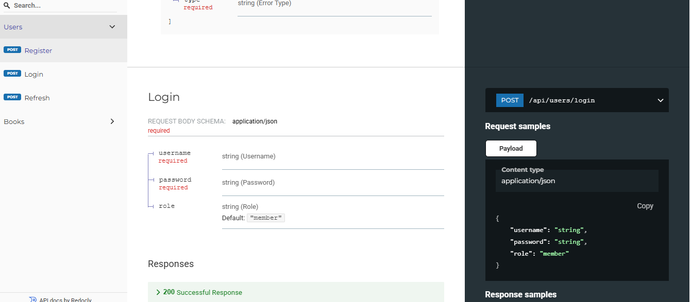
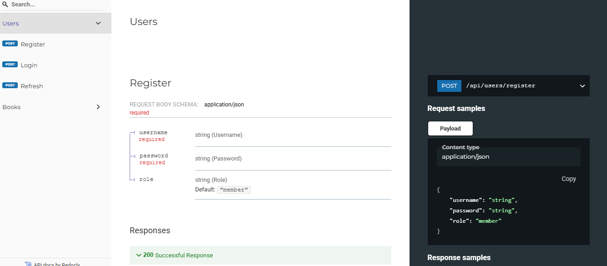
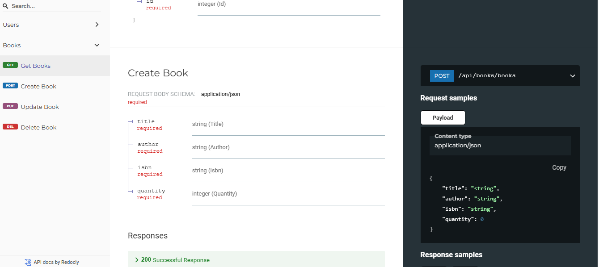
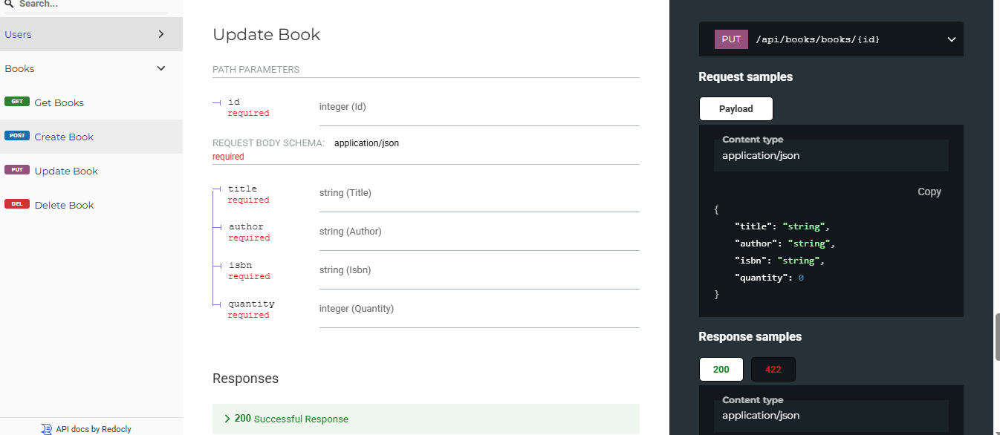
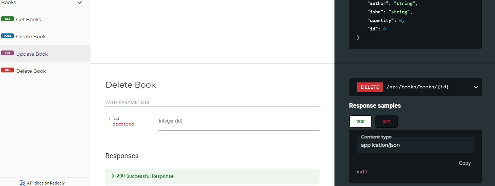
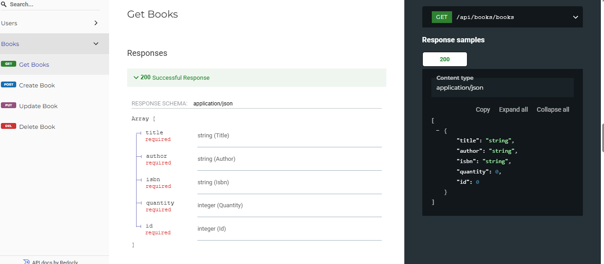

# 📚 Role-Based Book Management System (FastAPI)

A role-based Book Management System built with **FastAPI** and **JWT authentication**, supporting user registration, login, and access control for managing books.

---

## 👩‍💻 Author

**Anjali Kumari**  
📧 Email: ak3325624@gmail.com

---

## 🚀 Features

- ✅ User registration, login, and token refresh (JWT)
- ✅ Role-based access:
  - `admin`: full CRUD
  - `librarian`: create, update, read
  - `member`: read-only
- ✅ CRUD operations on books (title, author, ISBN, quantity)
- ✅ Swagger docs for API testing
- ✅ Modular project structure

---

## 🖼️ Screenshots

| Login | Register | View Users |
|-------|----------|------------|
|  |  |  |

| Create Book | Update Book | Delete Book | View Books |
|-------------|-------------|-------------|------------|
|  |  |  |  |

| Tech Stack |
|------------|
|  |

---

## 🛠️ Tech Stack

- Python 3.10+
- FastAPI
- SQLAlchemy
- SQLite (default)
- Pydantic v2
- Uvicorn
- JWT (`python-jose`)
- Password hashing (`passlib[bcrypt]`)

---

## 🗂️ Folder Structure

```
book-management/
├── main.py
├── requirements.txt
├── README.md
├── tests/
│   ├──test_basic.py
├── assets/
│   ├── create_book.png
│   ├── delete_book.png
│   ├── fastapi.png
│   ├── get_book.png
│   ├── login.png
│   ├── register.png
│   ├── update_book.png
│   └── user.png
└── src/
    ├── api/
    │   ├── books.py
    │   └── users.py
    ├── core/
    │   └── config.py
    ├── deps/
    │   └── auth_deps.py
    ├── db/
    │   └── database.py
    ├── models/
    │   ├── book.py
    │   └── user.py
    ├── schemas/
    │   ├── book.py
    │   └── user.py
```

---

## 📦 Installation & Setup

### 1. Clone the project

```bash
git clone https://github.com/your-username/book-management.git
cd book-management
```

### 2. Create a virtual environment

```bash
python -m venv env
env\Scripts\activate    # Windows
# or
source env/bin/activate  # macOS/Linux
```

### 3. Install dependencies

```bash
pip install -r requirements.txt
```

### 4. Run the server

```bash
uvicorn main:app --reload
```

---

## 🔐 API Overview

### 🧑 Users

| Method | Endpoint              | Description         |
|--------|-----------------------|---------------------|
| POST   | `/api/users/register` | Register new user   |
| POST   | `/api/users/login`    | Login & get token   |
| POST   | `/api/users/refresh`  | Refresh token       |

### 📚 Books

| Method | Endpoint               | Role Access       | Description         |
|--------|------------------------|-------------------|---------------------|
| GET    | `/api/books/books`     | All roles         | View all books      |
| POST   | `/api/books/books`     | Admin, Librarian  | Create a book       |
| PUT    | `/api/books/books/{id}`| Admin, Librarian  | Update a book       |
| DELETE | `/api/books/books/{id}`| Admin only        | Delete a book       |

---

## 🧾 Sample Schemas

### UserCreate

```json
{
  "username": "anjali",
  "password": "yourpassword",
  "role": "librarian"
}
```

### BookCreate

```json
{
  "title": "Atomic Habits",
  "author": "James Clear",
  "isbn": "978-1234567890",
  "quantity": 5
}
```

---

## 🔐 Using JWT Auth

Send this header with every protected request:

```
Authorization: Bearer <your_token_here>
```

---

## 📘 API Docs

- Swagger UI: [http://localhost:8000/docs](http://localhost:8000/docs)
- ReDoc: [http://localhost:8000/redoc](http://localhost:8000/redoc)

---

## 🧪 Future Improvements

- ✅ Add logout/token blacklist
- ✅ Add pagination/search on books
- ✅ Add unit testing with `pytest`
- ✅ Add email confirmation or OTP
- ✅ Optional admin panel UI
